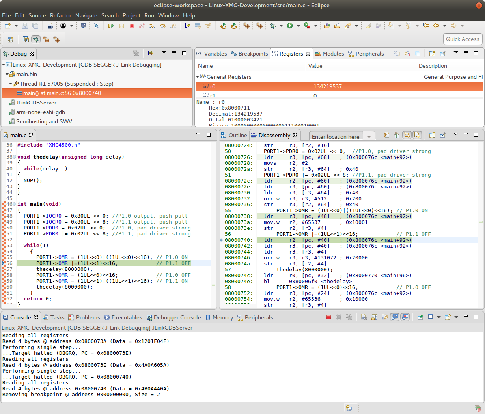
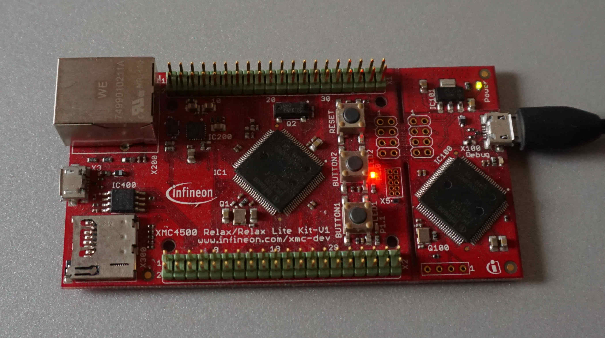
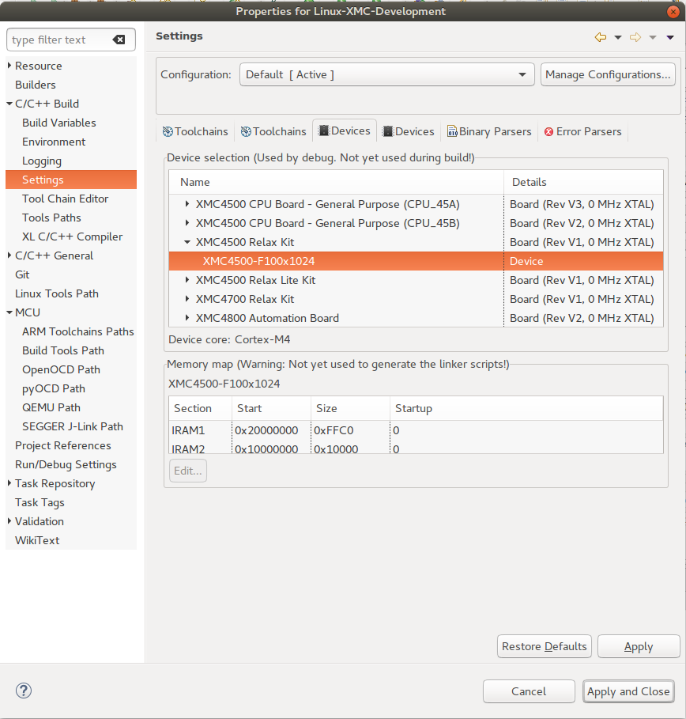
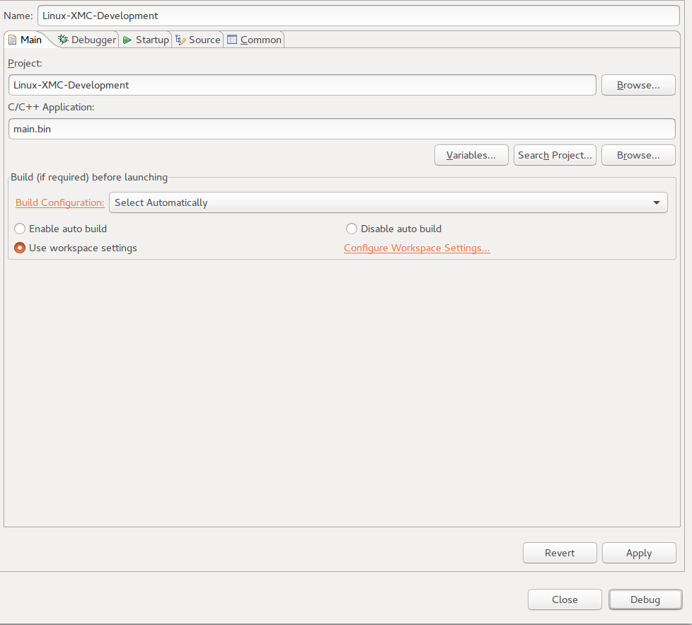
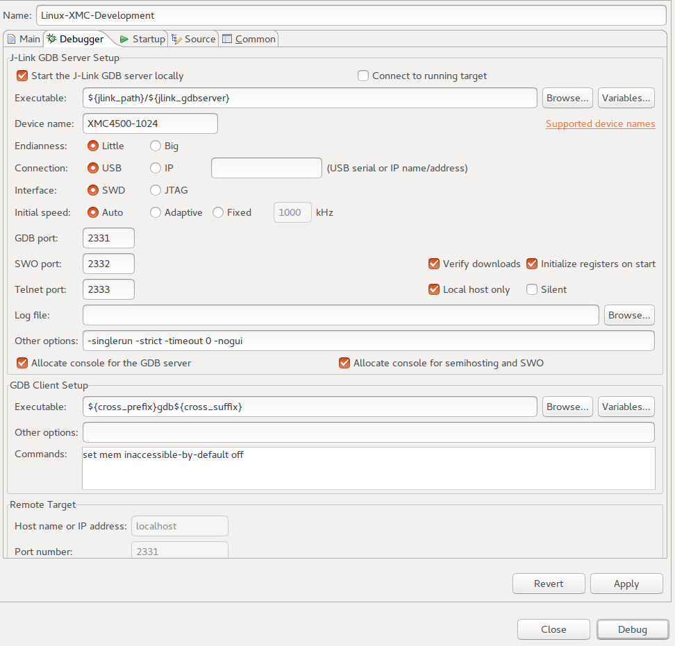

# Linux-XMC-Development
GNU toolchain for XMC software development






## Automake initialization of new XMC project

Most of the following explanations how to create a new automake project is perfectly explained on
http://mij.oltrelinux.com/devel/autoconf-automake/

## Initialization
To create a new automake project, only two files and the src directory are necessary:
- configure.ac
- Makefile.am
- src/

## Command line tool sequence
Please execute the following commands in order to use automake to create a makefile

```{r, engine='bash', count_lines}
> aclocal
> autoconf
> automake --add-missing
configure.ac:10: installing './compile'
configure.ac:7: installing './install-sh'
configure.ac:7: installing './missing'
Makefile.am: installing './INSTALL'
Makefile.am: error: required file './NEWS' not found
Makefile.am: error: required file './README' not found
Makefile.am: error: required file './AUTHORS' not found
Makefile.am: error: required file './ChangeLog' not found
Makefile.am: installing './COPYING' using GNU General Public License v3 file
Makefile.am:     Consider adding the COPYING file to the version control system 
Makefile.am:     for your code, to avoid questions about which license your project uses
Makefile.am: installing './depcomp' 
Makefile.am:12: warning: 'CFLAGS' is a user variable, you should not override it; 
Makefile.am:12: use 'AM_CFLAGS' instead
```

To mitigate the four error messages, add a NEWS, README, AUTHORS and ChangeLog file to the project.
```{r, engine='bash', count_lines}
echo "" > NEWS
echo "" > README
echo "" > AUTHORS
echo "" > ChangeLog
```

Executing automake --add-missing should work now.


## Compile and link

The following command must be executed only to reconfigure the Makefile after the source directory structure has changed.
```{r, engine='bash', count_lines}
./configure
```

If there are only changes to the source files, it's sufficient to execute
```{r, engine='bash', count_lines}
make
```


## Install tools
In order to flash, debug and run the program on our XMC4500 µController we have to install eclipse and some addtitional packages.
 
Download and Install Eclipse Oxygen from the eclipse.org website
https://projects.eclipse.org/projects/tools.cdt

Install CDT feature, if not done yet

Install GNU-MCU features <br>
https://gnu-mcu-eclipse.github.io/plugins/packs-manager/

Download MCU settings from <br>
http://www.keil.com/dd2/pack/

Install arm gdb tool <br>
```{r, engine='bash', count_lines}
sudo apt install gdb-arm-none-eabi
```
The arm gdb debugger is used and selected in eclipse in the Debugger tab. The eclipse textbox shows <br>
${cross_prefix}gdb${cross_suffix} <br>
which is expanded to <br>
arm-none-eabi-gdb

Install SEGGER J-Link Driver <br>
https://www.segger.com/downloads/jlink/#J-LinkSoftwareAndDocumentationPack


## Create debug configuration

Open project properties and select XMC4500-F100x1024 device



Click on Apply and Close

Open debug configurations <br>
Create new GDB SEGGER J-Link Debugging configuration





Make sure that Device name is XMC4500-1024


## Blinky application

The blinky application code was originally shown in the following tutorial:
https://embeddedplaygroup.wordpress.com/2012/12/12/its-relax-time-blinky-led/


## Makefile.am 

```{r, engine='bash', count_lines}
INCLUDE_DIRS    = -Isrc/include
ACLOCAL_AMFLAGS = -I m4
AM_CFLAGS       = $(INCLUDE_DIRS) -std=c99 -Wall -O0 -g  \
                                  -DXMC4500_F100x1024 \
                                  -mthumb \
                                  -march=armv7-m \
                                  --specs=nosys.specs \
                                  -Wl,--gc-sections

CFLAGS = -g -O0

CC              = arm-none-eabi-gcc
CCAS            = arm-none-eabi-gcc
AM_LDFLAGS      = -g -O0 -Tsrc/linker_script.ld


bin_PROGRAMS = main.bin

main_bin_SOURCES =  src/Startup/system_XMC4500.c \
                    src/Startup/startup_XMC4500.S \
                    src/main.c
```

Reference for symbols in Makefile.am file:
https://www.gnu.org/software/automake/manual/html_node/Program-Variables.html

- std=c99: C99 dialect of C http://en.cppreference.com/w/c/language
- Wall: 
- O0: no optimization
- g: include debug symbols
- DXMC4500_F100x1024: value needed during compilations
- mthumb: ARM thumb 32 & 16 bit instruction set
- march=armv7-m: armv7 architecture
- specs=nosys.specs: needed because of error message (explained here: https://stackoverflow.com/questions/19419782/exit-c-text0x18-undefined-reference-to-exit-when-using-arm-none-eabi-gcc)
- gc-sections: enable garbage collection (more information: https://sourceware.org/binutils/docs/ld/Options.html)


